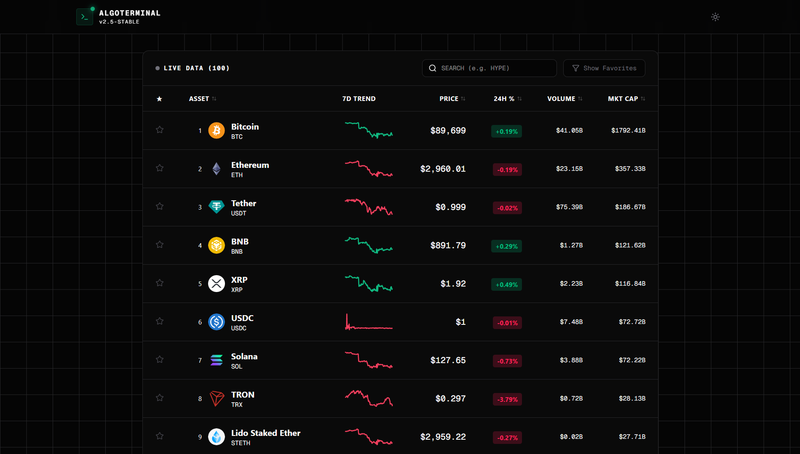

# 📈 AlgoTerminal | Built with ❤️ by AerynnnSh :3

> A real-time crypto market analytics dashboard built with Next.js 14, TypeScript, and Recharts.

 

## 🔗 Live Demo
🚀 **[View Live Demo](https://algoterminal.vercel.app)**

## ✨ Key Features

### 📊 Advanced Technical Charting
- **Interactive Area Charts:** Visualize price action with gradient fills using `Recharts`.
- **Technical Indicators:** Toggleable **SMA-14** (Simple Moving Average) and **EMA-50** (Exponential Moving Average) calculated in real-time using custom algorithms.
- **Dynamic Tooltips:** Hover over charts to see precise price and indicator values.

### 🛠 Tools & Utilities
- **Scenario Simulator:** A built-in Profit Calculator to simulate investment returns based on future price targets.
- **Real-Time Search:** Instant filtering of assets by Name or Symbol without API refetching.
- **Watchlist System:** Save favorite coins locally (LocalStorage persistence).

### ⚡ Performance & UX
- **Server-Side Rendering (SSR):** Optimized initial load with Next.js App Router.
- **Loading Skeletons:** Zero layout shifts during data fetching.
- **Responsive Design:** Fully optimized for Desktop, Tablet, and Mobile.
- **Dark/Light Mode:** Theme-aware UI components.

## 🏗 Tech Stack

- **Framework:** Next.js 14 (App Router)
- **Language:** TypeScript
- **Styling:** Tailwind CSS
- **Visualization:** Recharts
- **Data Source:** CoinGecko Public API
- **Icons:** Lucide React
- **Date Handling:** date-fns

## 🚀 Getting Started

1. **Clone the repository**
   ```bash
   git clone [https://github.com/username/algoterminal.git](https://github.com/username/algoterminal.git)

2. **Install dependencies**
   ```bash
   npm install
   # or
   yarn install

3. **Run the development server**
   ```bash
   npm run dev

4. **Open your browser** Navigate to http://localhost:3000

## 🧠 Algo Logic Highlight
One of the challenges in this project was calculating technical indicators on the client side. Here is a snippet of the EMA (Exponential Moving Average) calculation logic used in the chart:
  ```bash
  // Algorithm to calculate EMA-50
  const k = 2 / (emaPeriod + 1);
  let previousEma = 0;
  
  return rawData.map((item, index) => {
    if (index === 0) {
      previousEma = item.price;
      return { ...item, ema: item.price };
    }
    const ema = item.price * k + previousEma * (1 - k);
    previousEma = ema;
    return { ...item, ema };
  });
